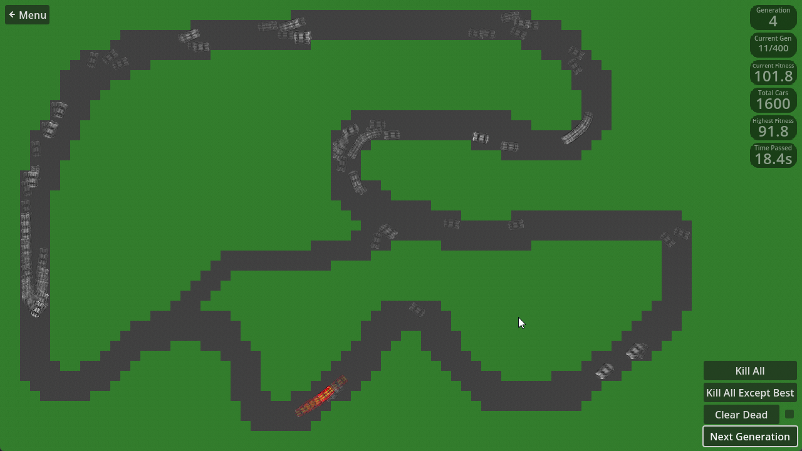
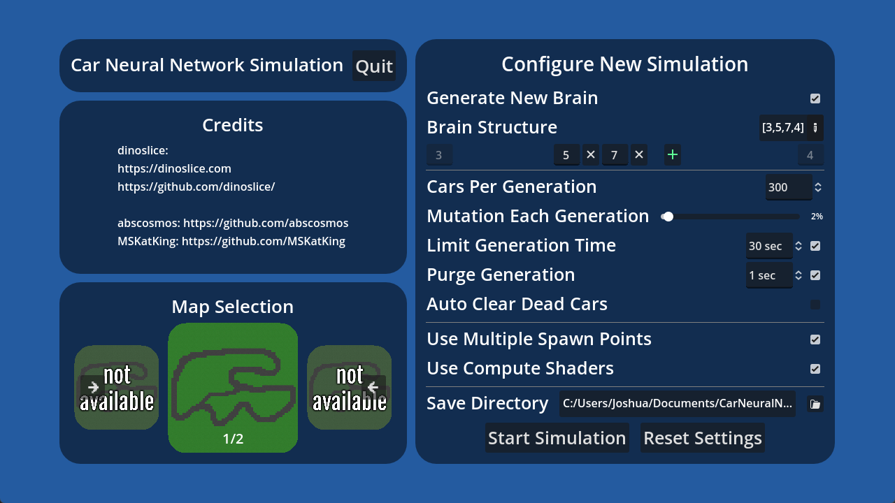

# Car Neural Network Simulation
A neural network simulation that trains cars to complete a track. Uses a evolutionary feedforward neural network without backpropagation, accelerated by GPU compute shaders.

## Features
- Train cars to complete a track
- Vulkan compute shaders with fallback CPU computation
- Evolutionary feedforward neural network
- Customizable layer structure
- "Reward Gates" to guide the car around the map

## Configuration
- `Load Existing Brain` from previous run
- `Generate New Brain` with 3 input neurons, customizable hidden layers, and 4 output neurons
- `Cars Per Generation`
- `Mutation Per Generation`, weights & biases [-1,1] are linearly interpolated to random float [-1,1] by the mutation value
- `Limit Generation Time`, cars are given a set time to drive before the best one is selected
- `Purge Generation Time`, cars that haven't crossed a reward gate after a certain amount of seconds have passed will be killed
- `Auto Clear Dead Cars`, at a set interval, all dead cars that aren't the best car are cleared from the screen and freed from memory
- `Use Multiple Spawn Points`, cars are spawned at different places around the map to potentially avoid overfitting
- `Save Directory`, where saved_brain.braindata files are saved (default is `[Documents]/CarNeuralNetowrkSimulation/`)
- `Map Selection`, select different maps to train the cars on

## Images
### Main Menu

### Level 1

